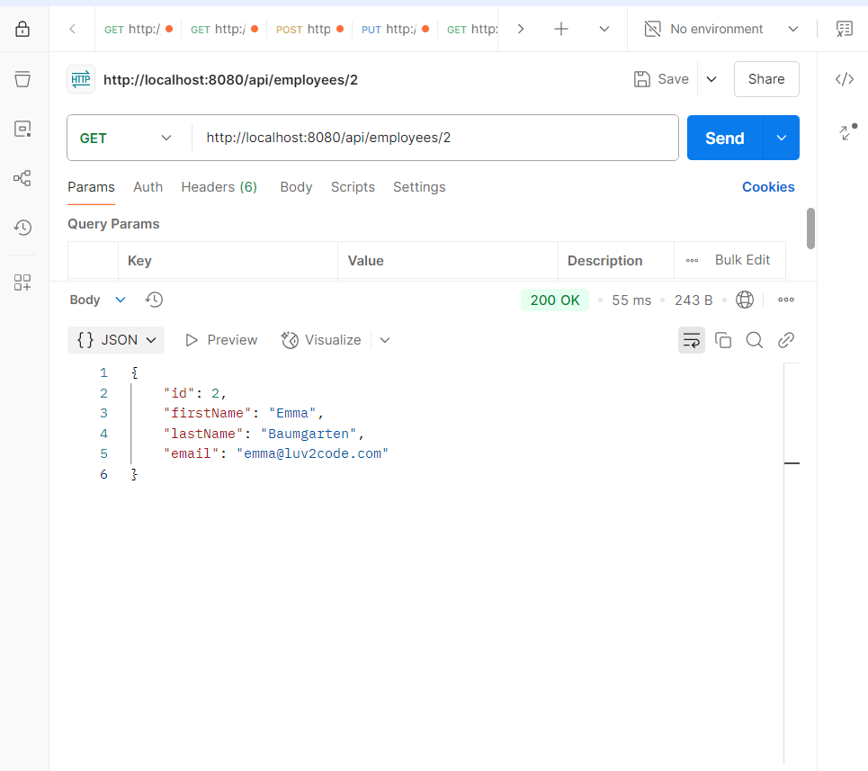

This Is a REST API using SpringBoot.
The API provides CRUD operations on a employee database in mysql.
Create a employee_directiry schema in mysql workbench and then create a employee table and add some sample data.
also application.properties file is removed which is used to connect with the database.
Create a resources folder in main folder and then create a application.properties file in the resources folder.
add this to the application.properties file:
spring.application.name=cruddemo
#JDBC properties
spring.datasource.url=#url to connect to the employee_directory database (jdbc:mysql://localhost:3306/employee_directory)
spring.datasource.username= #username of workbench connection
spring.datasource.password= #password of workbench connection

screenshots:

List of all employees:

Get employee by id:

Add new employee:

Update existing employee:

Delete existing employee by id:

